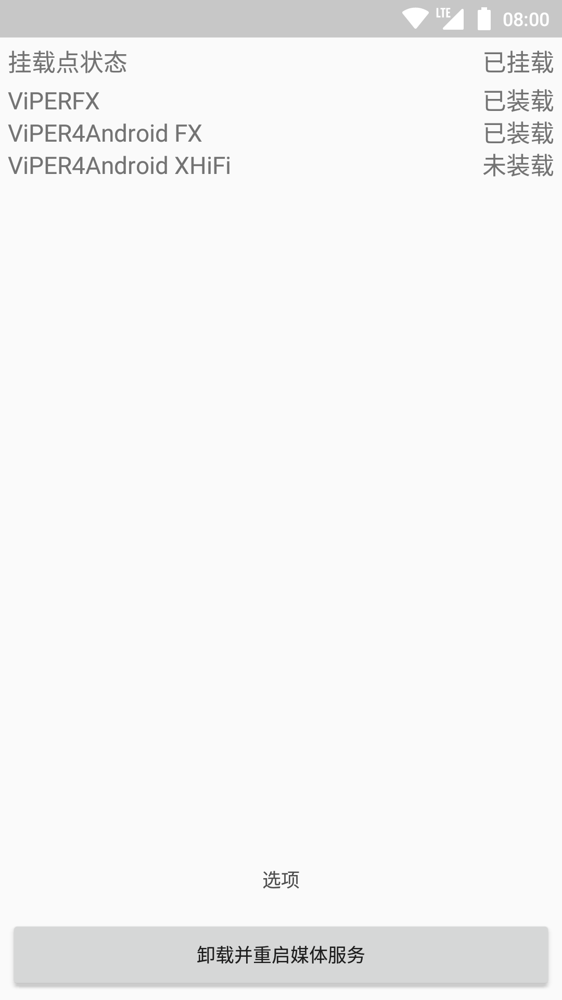
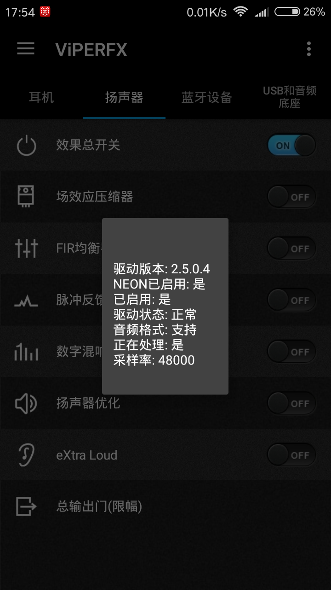
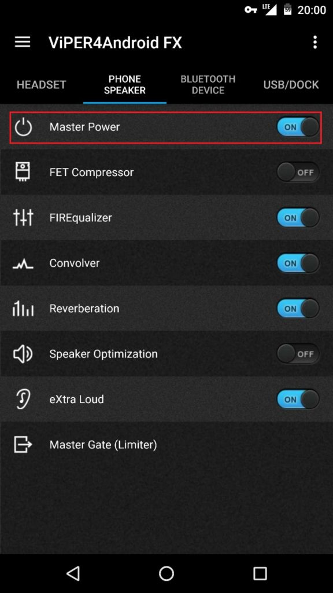

請準備
1.一台ROOT過的手機
2.下載 [V4A](https://www.blogger.com/blog/post/edit/2972384503992174876/8036234436872949146#) [蝰蛇音效驱动挂载器](https://www.blogger.com/blog/post/edit/2972384503992174876/8036234436872949146#) 各種音效文件3.一個腦子

首先安裝 任意版本的V4A(ViPER4ANDROID)

**1.打開掛載器裏 進 “選項”**

勾好之後反回第一屏

如果顯示這個就說明好了。

**2.進V4A**

左上角，驅動信息，如果顯示下面這樣就說明掛載成功了

**3.去百度或者個種論壇找 "音效文件(.prf後綴)" 和 “脈衝文件(.irs)”** 

音效放到路徑 ":\ViPERAndriod\Profile\”裏

脈衝文件放到":\ViPERAndriod\Kernel\”

在軟件右上角，加載音效(加載完之後不要忘了開啟)

脈衝文件同理

以上
