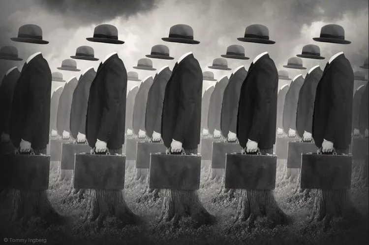
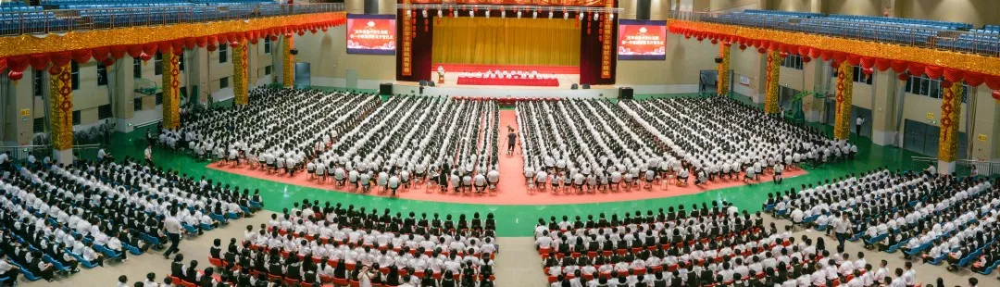
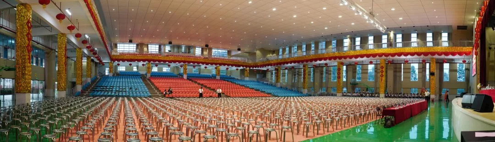
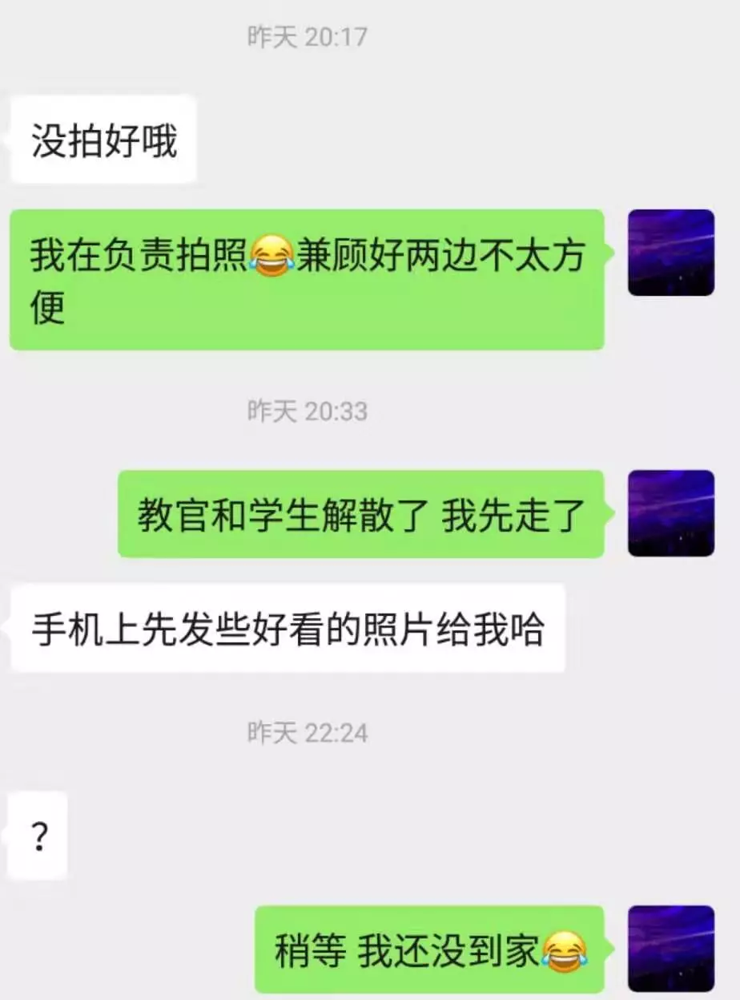

先说说我做的是啥,外行人口中的摄影师.但很可惜,并不是电影或者电视剧里那种拿着相机记录美好生活的摄影师,也没有渠道在国家地理杂志、报社里批判现实.甚至只能偷偷摸摸地开一个公众号,在一个没有加任何客户的小号里发泄自己的情绪.

以前在学校,学习上、社团里 遇到不爽的 直接骂.

啥也不懂、啥也不会、啥也做不好,该不该骂?

哪用计较什么后果?大不了不干了,反正我走了肯定天下大乱.

现在呢?为了搞点💰..容易吗???

客户也是..啥也不明白,凭什么指挥我做事?

这个客户说来话长,但是我打算从今天开始讲起,之前的罪行慢慢补充.

2019-8-22

   拍摄东莞某私立教育机构的军训开营仪式,酬劳就那么几百.甲方不是这家私立教育机构,而是“向日葵教育”的一个人.拍摄要求是拍教官、拍领导、拍学生.表面上也没多过分.过分的是我去到拍摄现场之后

   我去到了东华的5号门,..不小心说出来了,算了懒得改.门卫说一定要里面的人领我进去.我就打电话给他了.他直接说:“你看到篮球场没有?你进去之后直接往前走就能看到xxxxx”讲的很快很不清楚,我还没反应过来,那边就把电话给挂了.

我跟门卫说,门卫坚持要人领进去,我只能再打电话,让门卫跟他沟通,在门卫的交涉之下他终于肯出来带我进去了(感谢东华的门卫大哥)

   然后,活动开始之前,

她跟我说:“活动开始之后你拍个精彩点的小视频给我,我发朋友圈做宣传”

拜托啊大姐,说好来拍照的,现在突然间叫我帮你拍视频?

我肯定不愿意啊

我就说:“不用拍很好,你拿手机拍个十秒给我就行了”

既然这样我也没办法了,拍片佬说到底也是服务业,尽量满足客户的需求

   一个活动拍照的话,一般只会负责拍照,很少情况会一边拍照一边拍视频,自己有玩过相机的都知道,拍照片和拍视频两个用的档都不一样,而且活动重要的是抓拍,干活要求是给照片,肯定在保证照片质量的前提下,再完成额外的要求.一些东西错过就没有了,我的注意力当然是拍照片为主

   我按照她所说,拍了几个视频,她又说“没拍好哦”,附赠的你还想怎样?难道我的手机还会帮我把素材自己剪好?她又补充:“你要把舞台上精彩的表演拍下来,还要把台下孩子的气势拍出来,我才好宣传”

**1.校方自己有全程录影,不给上舞台拍**

**2.他的舞台高1.5米(至少)**

**3.一条10s的一镜到底要如何把舞台上的表演和台下的气势同时拍到呢?**

**4.如何把根本不精彩的表演和台下死气沉沉的学生拍得有气势呢?**

这并不是最过分的,最过分的是事后..

拍摄地点是松山湖的园区,我家在东莞一个偏僻的破镇

原定拍摄时间19:00-20:00

结果他们20:30才搞定一切

他们不报销车费,给的钱又少,我坐公交回家不过分吧,至少两个半钟

我20:30跟她说走,她要我先发她照片?大姐,可以是可以,但没必要.说白了,你给的钱太少了.难道我要耗费半小时用手机wifi把照片挑出来在回家?错过末班车我不就白给了?

一般人,工作完之后都会问的问题是:你开车回去吗?这么晚了,用不用送你回去?路上小心,注意安全...等等.保证我最基本的东西,再谈工作.我起码得到了作为摄影师的尊重,但是我从她身上没有感觉到自己被尊重.我只是帮她拍照的工具而已.上来就要我发照片?要是多关心我一点,我还能硬撑着从相机里传几张出来.但是你?算了吧.

无论做什么行业,只要你是真心希望帮助对方,对方也会全心全意为你付出,如果对方只是达成你某种意图的工具,合作肯定不会太顺利.

干过活才知道,一句“**谢谢,辛苦了**.”有多大的鼓舞

并不是花钱买的一切都是理所当然的
