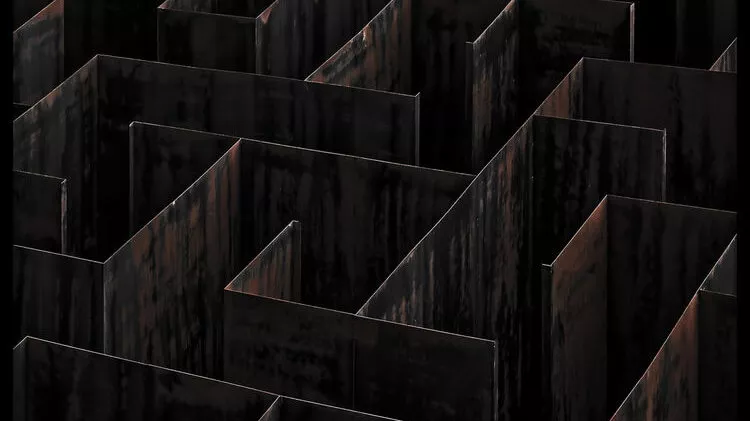
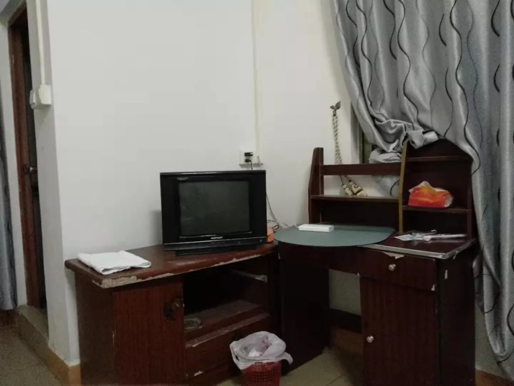
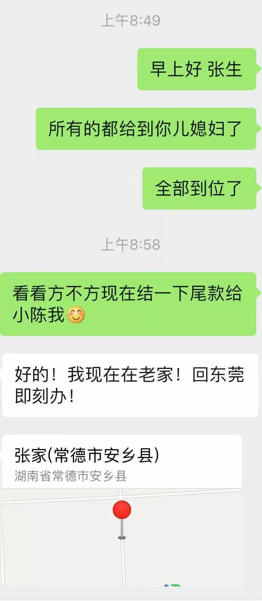

**树多必有枯枝**

**人多必有白痴**

有些甲方就像一朵十分罕见又娇艳夺目的奇葩,我的花园里栽满了花,散布在大大小小的花坛.而这一朵朵奇葩的存在,让我的日子充满了挑战....

原本的名字太粗暴,所以改成Kulafan's Garden.我自己喜欢就好了

*2019/8/11*

这一单的客户,不断地挑战我的极限.

拍摄内容是8.11 早上6:00到新郎家拍.然后去接新娘,再去午宴.原定8.11上午**4:00AM**从**道滘出发到惠州.**但是甲方担心时间不够所以在8:10号晚上安排我们去惠州的酒店.我们到达酒店已经23:00了

但是酒店距离新郎家有13公里,半小时车程.,惠州这个穷乡僻壤,打车非常不方便,(瞬间觉得东莞太好了).只能和张生(甲方)沟通,让他早上五点派车过来接我,保证我6:00能到新郎家开始拍摄.

这个张生脾气非常暴躁,直接开喷:“明天这么忙,我哪有那么多时间,明天五点钟没有人能去接你,今晚我在附近找个地方给你住,明天五点四十打电话给我,我去接你.”我除了接受还有什么办法?耽误拍摄的话我要负责的.

所以他一点钟就来酒店把我接去他家附近的地方住.

¥68

仅售¥50/晚

张生对房东说:“68这么贵?他住到五点就走了,都呆不了多久”(那时候2:00)

其实环境我还能忍,忍不了的是空调不凉...吹出来的都是热风,除了噪音大以外,完全感受不到空调的存在.所以我就从两点玩手机到天亮.

给我的房间是401,走廊最角落,晚上能听到有哭声,我五点钟走人的时候,在楼梯口听到女人的哭声,非常明显,但是不敢作死,就当作没听到走开了.

너무너무remarkable的经历

感觉人生又解锁了一个成就

毕竟一般人 对待摄影师都十分尊重

怕你休息不好、怕你口渴、没吃饱影响拍摄的发挥

但是这家人真的是婚庆市场客户中的一朵奇葩.

这些事情我都可以不跟你计较,毕竟从ssl出来的,多热的房间没睡过?而且我本身接触灵异事件比较多,对这些东西也不是多害怕.我不怕鬼,但是我怕穷.

这家人从头到尾一封红包都没给我们拍摄团队.

一般的接亲流程里,给伴郎发完红包之后,是要给摄影团队的,毕竟讨好摄影师,才能拍好啊.

第一次没有给到,可能他们忘了?所以我第一次提示:“伴郎们,想快点接到新娘的话,我教你们一个方法,你们给摄影师一个大红包贿赂一下,让摄影师给你们通水,就能快点接到了.”貌似没有啥效果.

第二次,有小孩讨红包,叫他舅舅,他就给了.这时候我们拍摄团队再次行动,把摄像机怼在他面前,在红包面前晃来晃去,他还是不会做人..

总共提示了七八次吧.到最后我们一分钱的红包都没讨到,应该是故意不给我们的.既然这次结婚没给,那我只好祝他下次结婚的时候记得给了.

总感觉新郎很不愿意结婚,虽然新郎长得一般般,但是新娘更加一般般.新郎全程板着脸,一点笑容也没有.一般来讲,一对新人在一起,肯定会又激动又兴奋,忍不住地偷笑.但是我完全感觉不到.

拍午宴地时候啊,甲方连饭也没给我们吃,2:00我们走之前出于礼貌跟他说:“你好,这边地拍摄差不多结束了”

他说:“**这样啊,那你们走吧走吧走吧”**.....

正常人不应该关心我们吃了没有?

到最后还是要按照正常的流程剪片 出片 还要忍气吞声

你给尾款 跟你在哪里有关系吗????信息时代了啊

他最后还扣了1000块钱,**原因:对拍摄团队不满意**

张生原话:“**你要还是不要??**明天早上,要是没搞定一切,直接摊牌”

我们有什么办法?????
