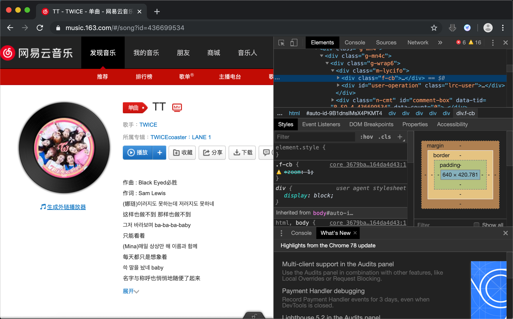
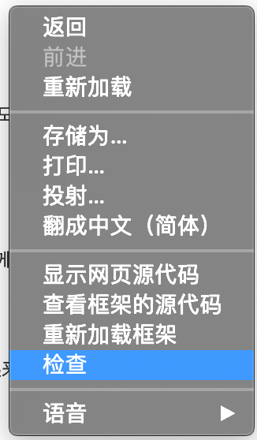
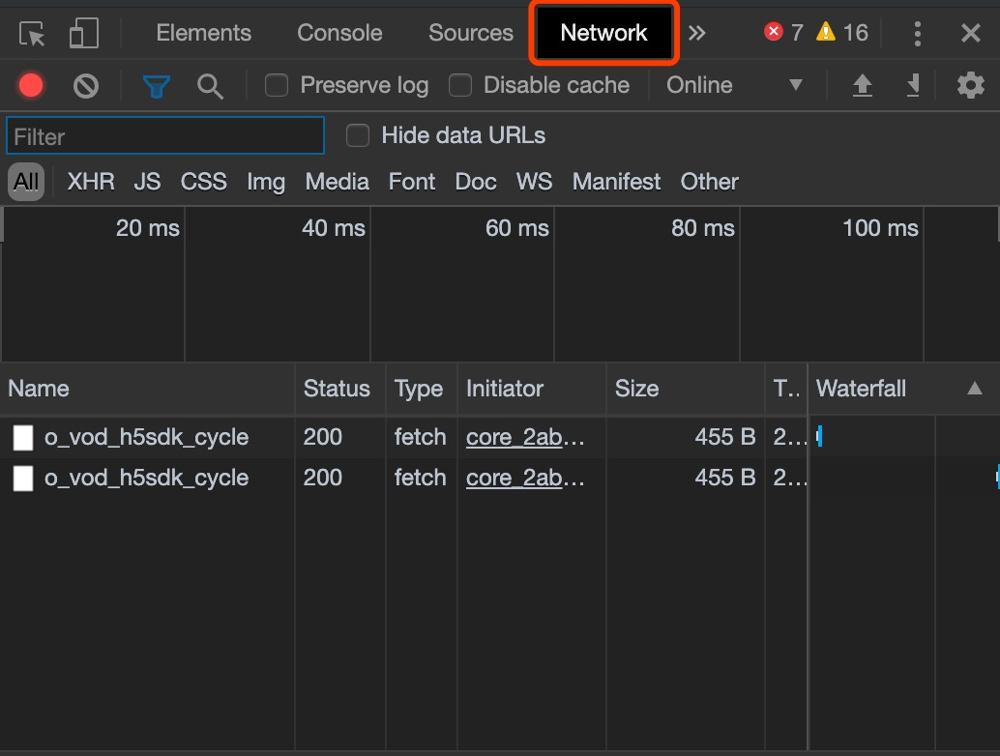
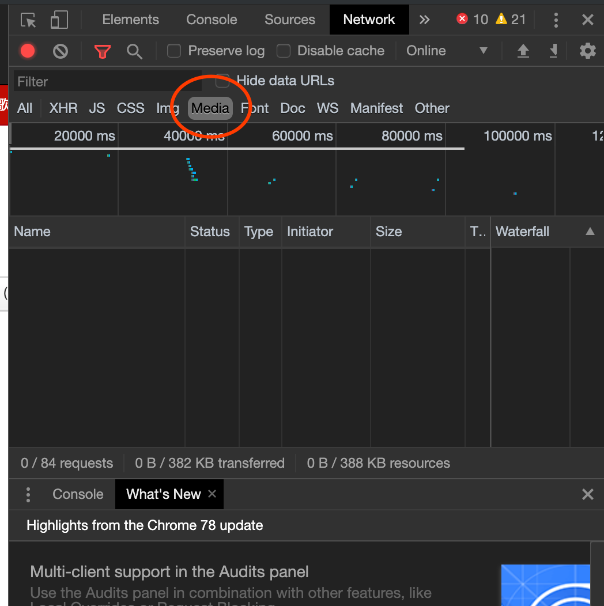
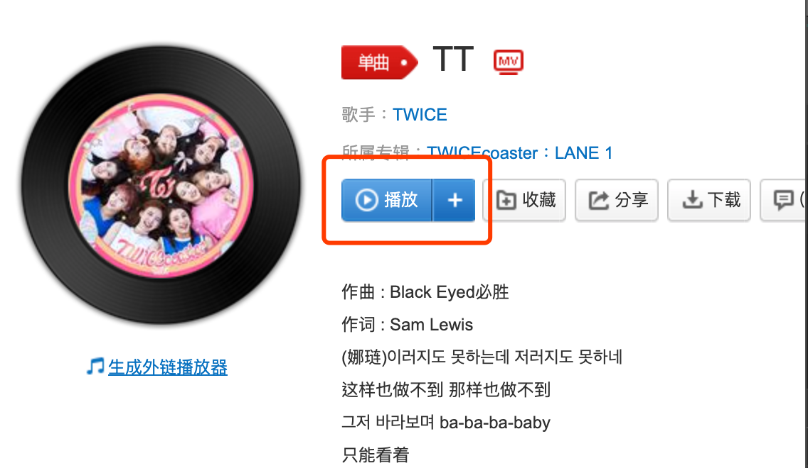
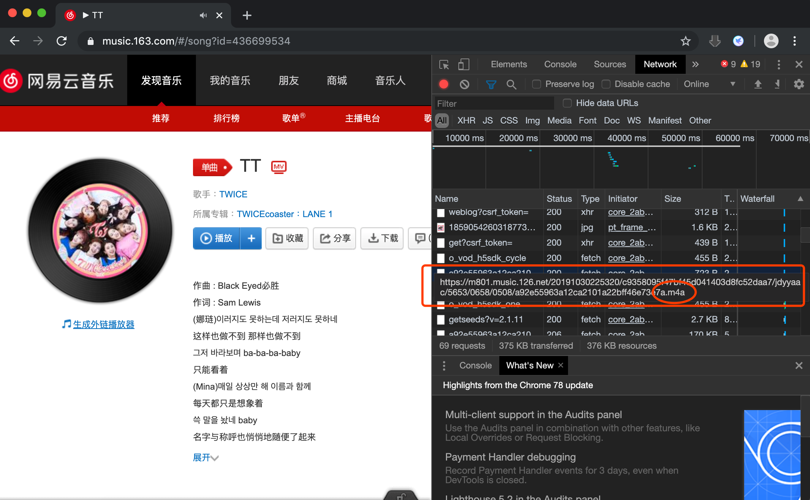
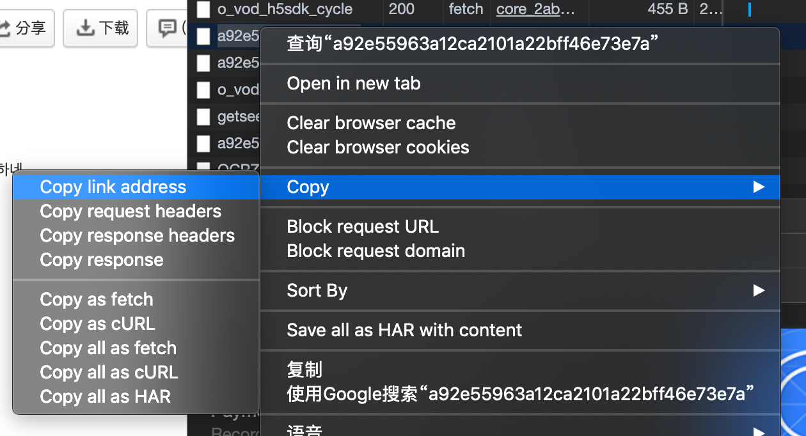
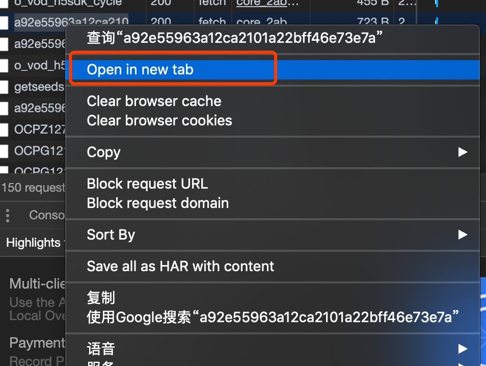
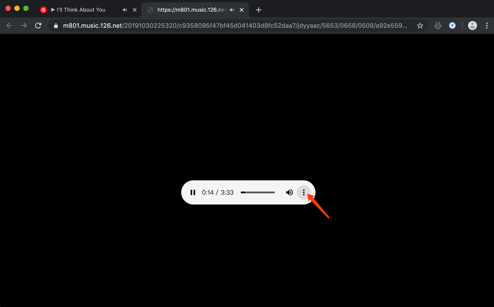

这个方法可以下载任意媒体文件,视频音频都可以

1.下载chrome浏览器

2. 打开网址按 “F12”打开console, 

或者 “右键”-“检查”

3.在console上打开 network 一栏

有的网页可以通过media过滤,但是网易云不支持,所以只能在“all”一栏找.

4.播放你要获取的媒体

5.在下面找到媒体文件的后缀

音乐一般为mp3 aac m4a…….

视频一般为mp4. Flv …..

每个网站的格式都不同,靠自己发现

网易云音乐的格式为m4a

6.右键 copy - copy link 

复制好链接之后可以到下载软件 粘贴 下载

或者可以在新窗口打开 

在浏览器打开这个文件试听,确认了之后按三个点通过chrome进行下载

\---------------------------------------------

可能遇到的问题

1.播放之后没有文件,按WIN/Command+R刷新页面

2.blob的视频用这个方法不能下载,需要用更复杂的方法.
3.这个方法下载到qq 网易等国内播放器的音频只有128k,想听音质的找其他方法,这个只是扒素材用的而已.