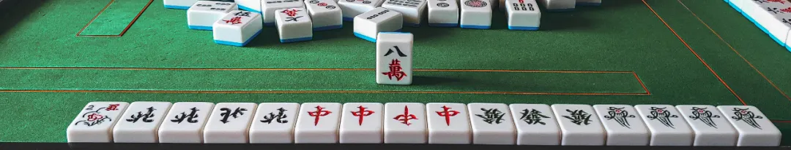
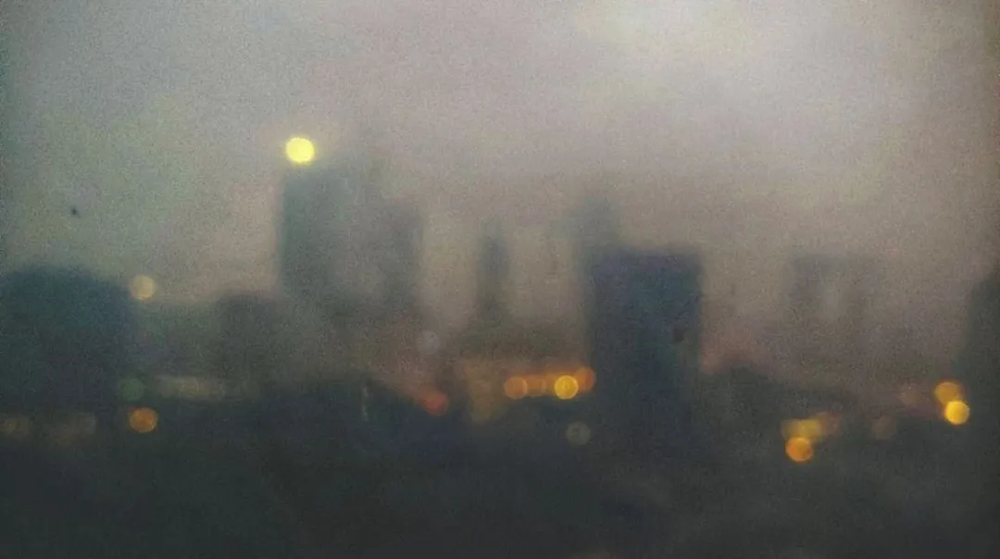
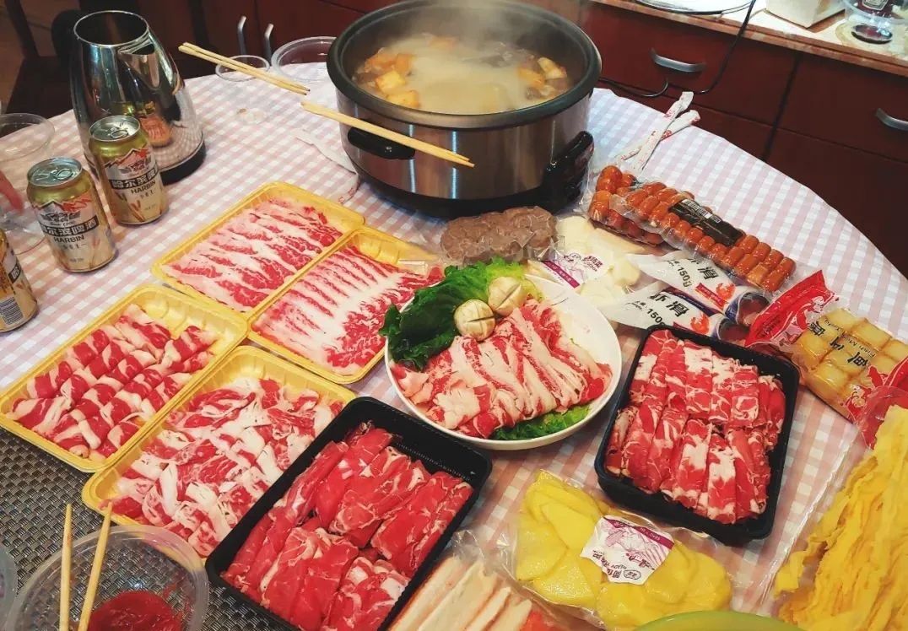
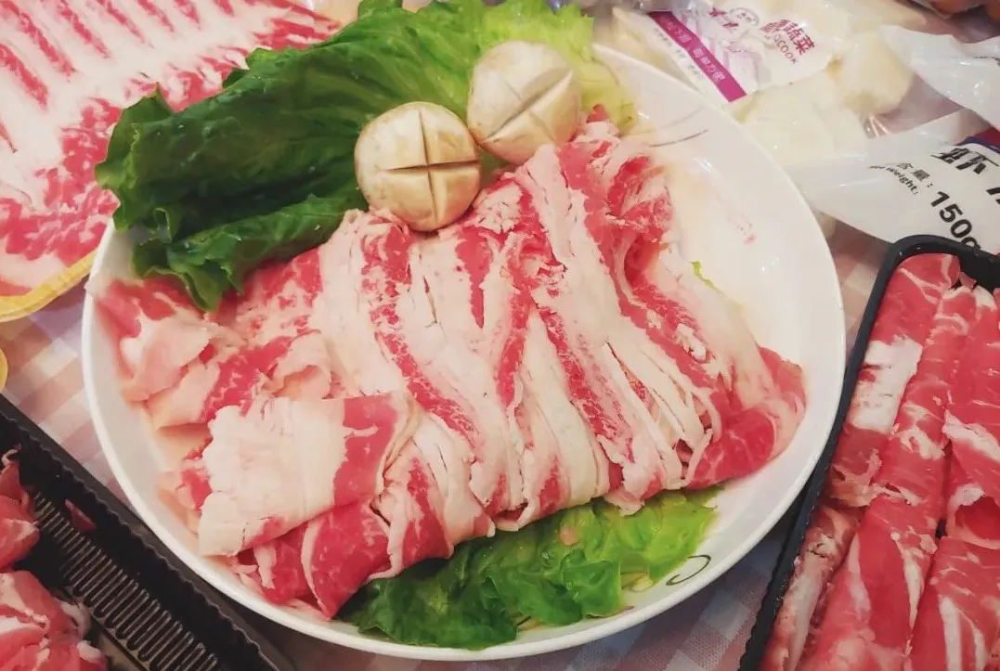
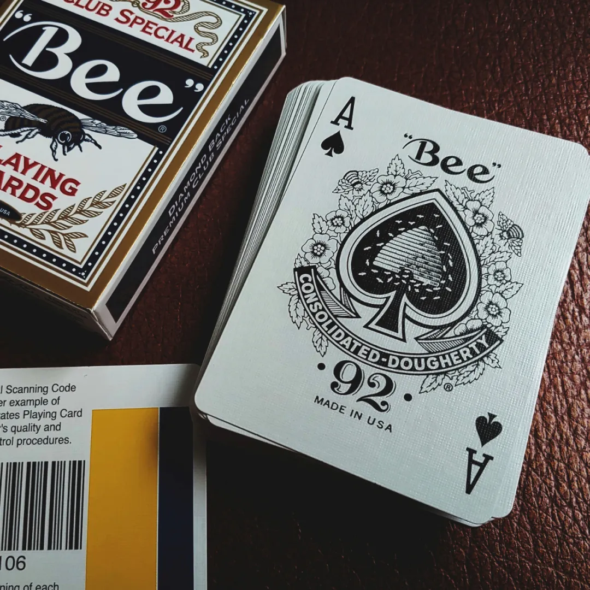
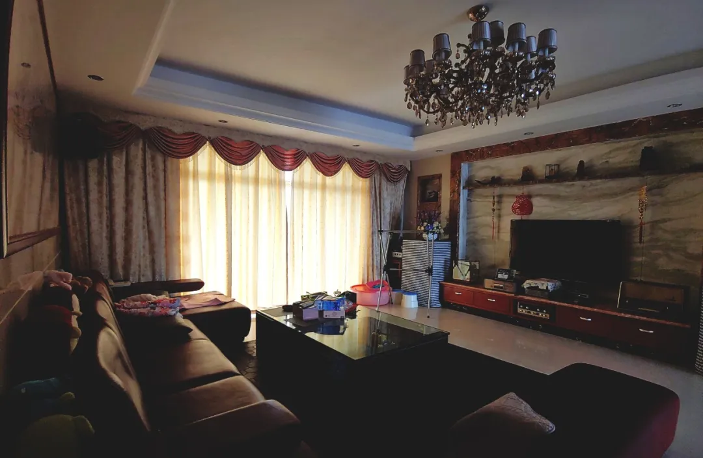

我不否认我是个杠精

清明假期后就经历了太多破事，想记录下来又不知道从何说起，又无意中看到一篇周记，就想跟风写写周记，可是一匹布那么长。

**#后疫情时期NG第一次聚会**

**清明假期**

2020.4.4

疫情稍微好转之后的第一次聚会，出乎意料的齐人。久违地打了一次篮球，然后又匆匆忙忙走了。人多的聚会到最后必定是各回各家，最后只留下我们几个人在2101夜谈。可能就不应该开这个头，这样也就没有后面的事情。一直聊到四点才舍得睡。

五点多 外面的闪电透过窗帘照进窗户，整个房间都被打亮了，Con醒了，刚刚的光好像宿管拿手电筒查房，条件反射就醒了。我过去拉窗帘，外面全是雾气。

走之前喝了个早茶，然后无可奈何地回家了。

**#后疫情时期NG第二次聚会**

**2101厨房全面升级

**

2020.4.18

CON买了一口空气炸锅，我买了一口煎炸蒸煮都可以用的电锅，于是2101迎来了一次厨房的大升级。集合前我们再三确认，CON又说：“全部菜都带起了。”我们也没多问，就出发了。

到了之后，CON只拿出了鸡柳 鸡扒 鸡米花？原来CON说的菜是下酒菜。。我们群里的意图是想做正菜啊，只能去超市买了。其实我挺喜欢逛超市的（反正能走路的都挺喜欢的）

我、con、foafa去买菜了，剩下几条佬在2101打麻将和三国杀，等我们买完回来他们已经把炸好的鸡米花鸡排都吃完了？？还把我买的可乐喝剩1/3？

妈的一群死佬，吃个饭还拍拍拍，都饿死了还要拍，拍个啥？？？我雕的两个菇又不给个CLOSESHOT🤮

接下来的谈话，填充了很多由于在必要情况下不在场而造成的记忆缺席。

CON在1月份买的煮酒器终于发挥了装饰性作用，煮酒论英雄总算达成了。

**#3**

***\*只有我们仨\**

**

2020.4.25

今天早上刚刚到的BEE..

想出来聚一聚真的不是为了玩什么，就是为了聚一聚而已。

把早茶、刷锅水（咖啡）、啤酒、冰水 古今中外的饮料都喝了一遍

把骰子、麻将、斗地主、SHOWHAND、德州扑克，也玩了一遍

BEE的手感真的好，玩了一遍之后就回不去了。

走之前还是一如既往想找借口多增加一两项活动，不过实在是没办法了。。

可能其他NGer生活太充实了，但少闲人如吾两人者耳。

***\*#没了吧\****

