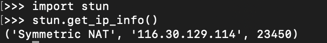

## 测试方法

首先用terminal安装python

```
python3
```

如果返回没有安装就输入

```
brew install python3
```

安装python之后 安装pip

```
python -m ensurepip 或 python3 -m ensurepip
```

用pip安装pystun

```
python -m pip install pystun3
```

然后使用pystun3获取nat类型

```
python3
import stun
stun.get_ip_info()
```



输入后过一会就返回nat类型 ip 还有端口 等待的时间比较久。

## 关于nat类型：

NAT1：Full Cone NAT（全锥形NAT）；

NAT2：Address Restricted Cone NAT（受限锥型NAT）；

NAT3：Port Restricted Cone NAT（端口受限锥型NAT）；

NAT4：Symmetric NAT（对称型NAT）；

从nat1到nat4 限制增加 对于联机游戏而言 full cone 是最好的 nat2和nat3 也可以接受 但是nat4是受限的，可能甚至无法联机。。

> linux和windows的nat类型检测可以查看这篇文章：https://post.smzdm.com/p/akk5mn0r/

