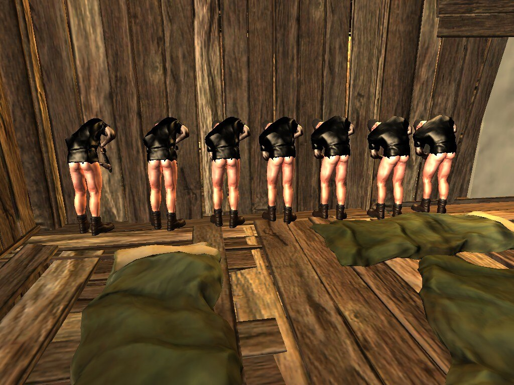

回想起最后一次痛快的玩游戏应该就是初三的那个暑假、那时候玩的是rust腐蚀

自那以后就上高中 然后就是断断续续地进行游戏。。。。。很久都没有持续一段时间地享受游戏带来的快乐。。玩rust认识了很多网友 大脸猫 00 数字 fk yuwen 神秘人。。那时候是2013 到现在也有10年了 我弟弟现在还跟他们在一起玩 只是换了别的游戏 但是这种关系真的很神奇。不过大脸猫在2014年就没有跟我们一起玩了 据说他是为了工作没时间再一起玩了。。那时候我还是不理解为什么工作了之后就会跟游戏冲突呢。。。。工作了应该也有时间玩游戏吧。。。

直到我上了高中之后才意识到曾经的我太理想化了，而且小时候的精力好像怎么都花不完，后来的精力真的不足以支撑我一直玩游戏了。。有时间只想跟朋友唠嗑唠嗑，游戏也只是成了辅助的社交工具，那段时间唯一能够玩的就是王者荣耀了，因为不需要一大段时间去玩。

直到2023-7-24 在大爷的鼓动下买了文明6….然后一发不可收拾

第一天晚上玩得还挺顺利的。。就是延迟稍微有点高。不过也是勉强开始了游戏 第一天直接从九点打到凌晨三点。。。。

不过第二次的游戏体验就没那么好了，因为网络问题 我们三个人里面总有一个人掉线。。连续三天因为这个问题本来兴致勃勃地开始游戏 结果搞网络搞了三小时 最后游戏时间就两个小时。。。第二天又要去上班了

然后连续好几次都是 明明两个人能正常玩 但是一加入第三个人 总是很卡。。。

后面买了个网易uu。。加速 用线程模式 加速 就ok了 如果直接用路由模式的话 文明6是国区会导致无法在中国的ip下启动文明6。所以必须开启线程模式。开了网易uu之后的那两天游戏体验都还可以。。还是有一点点卡 但是也没有非常流畅。。。

其中我们还尝试了 easyN2N、乔尔文明6加速器、游侠对战平台。。

游侠的体验是最好的，毕竟是基于局域网。。但是价格太贵了。一个人20 三个人买套餐的话54一个月。。。

最后迫于无奈，在贫穷的限制下，终于找到了一个长久稳定的方法。就是修改NAT类型。。
