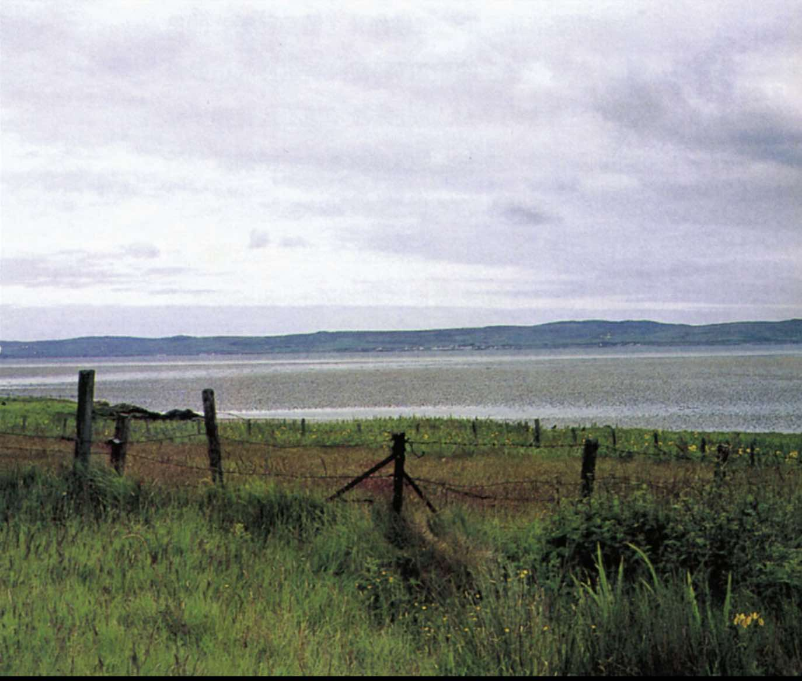
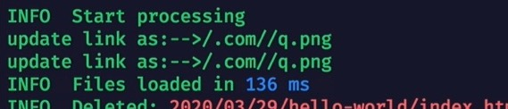
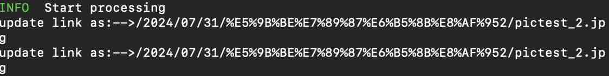

方法：

解決hexo部落格圖片無法載入問題（圖片地址重定向錯誤的問題）
改用以下外掛

```
npm install https://github.com/CodeFalling/hexo-asset-image
```

原先直接使用

```
npm install hexo-asset-image --save
```

在执行hexo g之后图片的相对地址会被重定向到-->.com/ 



使用新的地址之后就能正常重定向了



> 
>
> 【解决Hexo博客图片无法显示-哔哩哔哩】 https://b23.tv/0p6Ub5t
