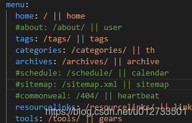
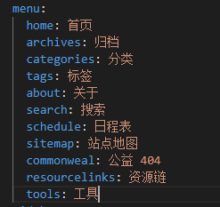
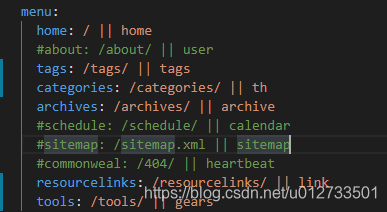
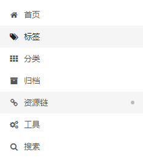

Next 自己的页面布局并不能满足要求的时候，就要自己自定义布局页面

1.新建一个工具栏的侧边栏

```
hexo new page tools
```

1
2.Next 主题配置_config.yml文件menu选项增加tools的链接和icon



3.languages文件夹中增加tools文字显示



4.显示工具的图标gears。这里的图标全部取之于 Font-Awesome https://fontawesome.dashgame.com 




5.效果




————————————————

                            版权声明：本文为博主原创文章，遵循 CC 4.0 BY-SA 版权协议，转载请附上原文出处链接和本声明。

原文链接：https://blog.csdn.net/u012733501/article/details/104896725
