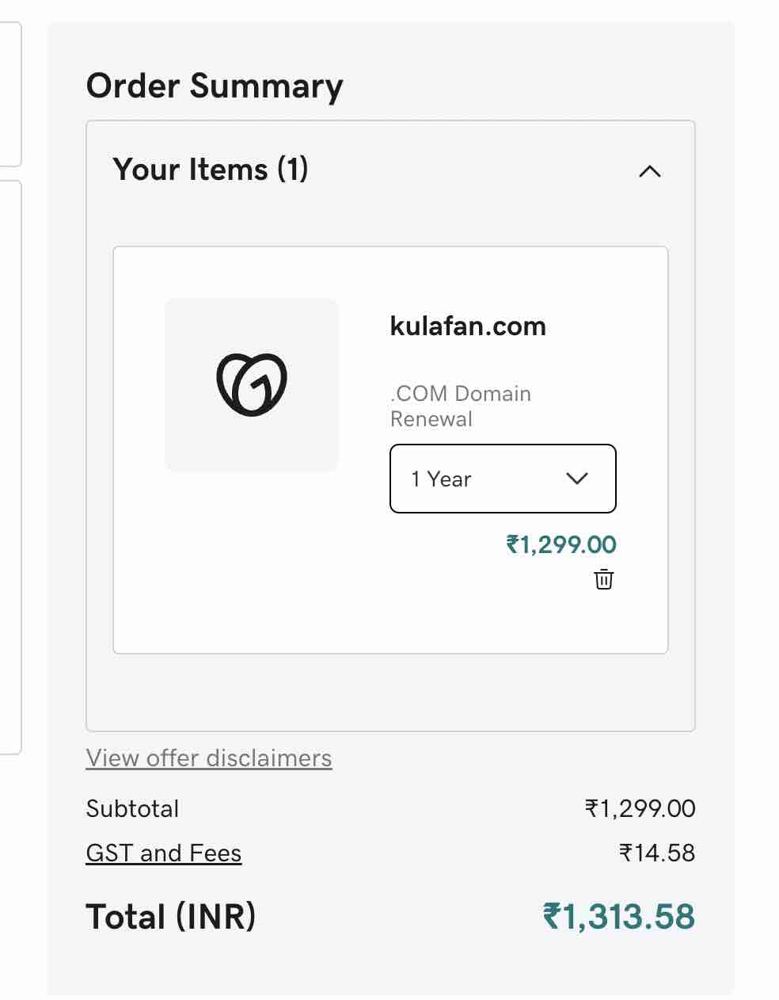
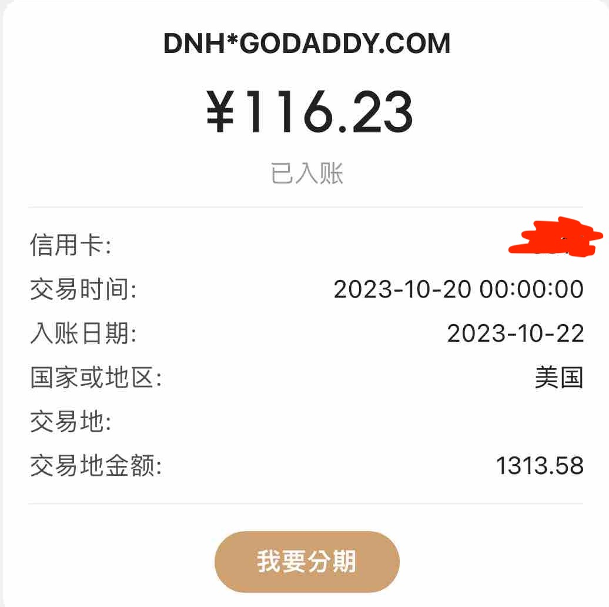
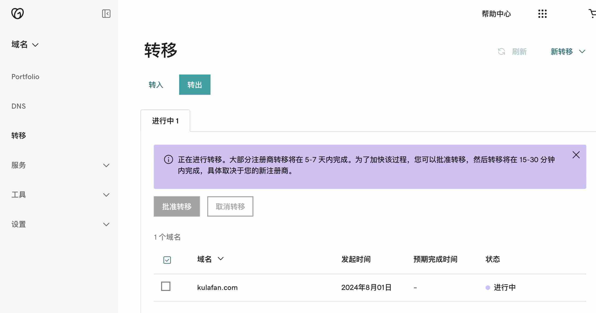

这个域名是从我2017年开始注册博客的时候就在godaddy上面买的，那个时候啥也不知道，就知道godaddy是全世界最大的域名注册商，而且价格还可以接受，那时候rmb注册和续费都是100多，如果切换成印度用卢比去计算的话只需要80多就可以了，这个是完全可以接受的价格。

但是后来慢慢涨价到120,我没有那么多精力去理这个事情，而且除godaddy之外我确实不知道还有没有其他更好的选择，120我勉强可以忍一忍。虽然那时候国内的价格普遍都是60一年

但是今年我看到域名的续费价格已经涨到了150人民币了...这个价格真的接受不了 于是就上网找有没有更好的方法，然后发现其实不止godaddy，其实国外的很多域名注册商都已经涨价了 都是差不多100，后来看到了cloudflare其实也有域名的注册服务，而且价格好像是这些里面比较能接受的了10美元换算下来70+

而且我之前一直都是用cloudflare加速来托管域名顺便加速访问，因为之前用的是美国的域名，但是之前的主机确实不太给力，所以我才把博客托ß管到GitHub了，开始用wp，后来嫌弃空间速度慢 而且不舍得给钱就转移到blogger上，再后来因为买了香港空间所以又转移到了wp，后面就是这次转移到了github。中途也丢失过一些数据，现在开始就好好经营托管到github尽量保留数据一直写下去。

