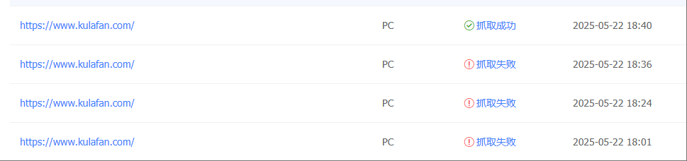

#### **一、架构概述**

- **部署平台**：GitHub Pages（静态托管）
- **域名解析**：Cloudflare（DNS 管理、CDN、SSL 证书）
- **目标**：确保百度蜘蛛（Baiduspider）正常抓取网站内容。

------

### **二、常见问题与解决方案**

#### **1. 抓取失败：Socket 读写错误**

- **现象**：百度抓取诊断提示“socket 读写错误”。
- **原因**：

- Cloudflare 防火墙拦截百度蜘蛛 IP。
- DNS 解析不稳定或 GitHub Pages 服务器不可用。

- **解决步骤**：

1. **检查 Cloudflare 防火墙日志**：

- 进入 Cloudflare 控制台 → **Security → Events**，筛选百度蜘蛛 IP（[官方 IP 列表](https://ziyuan.baidu.com/college/courseinfo?id=267&page=2)）。

1. **将百度蜘蛛 IP 加入白名单**：

- Cloudflare 控制台 → **Security → WAF → IP Access Rules** → 添加 IP 段，选择 `**Allow**`。

**验证 GitHub Pages 可用性**：

 

```
curl -I https://<username>.github.io # 替换为你的 GitHub Pages 地址
```


------

#### **2. HTTPS 重定向异常**

- **现象**：`**https://kulafan.github.io**` 重定向到 `**http://www.kulafan.com**`（不安全）。
- **原因**：GitHub Pages 或 Cloudflare 未正确强制 HTTPS。
- **解决步骤**：

1. **GitHub Pages 配置**：

- 仓库 → **Settings → Pages** → 勾选 **Enforce HTTPS**。

1. **Cloudflare 强制 HTTPS**：

- Cloudflare 控制台 → **SSL/TLS → Edge Certificates** → 开启 **Always Use HTTPS**。

**验证重定向链路**：

1. bash

   ```
   curl -L -I https://kulafan.github.io
   ```

     # 检查最终落地页是否为 HTTPS

------

#### **3. SSL 证书域名不匹配**

- **现象**：`**curl: (60) SSL: no alternative certificate subject name matches target hostname**`。
- **原因**：证书未绑定正确域名或 DNS 解析错误。
- **解决步骤**：

1. **检查 DNS 记录**：

- Cloudflare 控制台 → **DNS → Records**，确认 `**CNAME**` 指向 `**username.github.io**`。

1. **调整 SSL 模式**：

- Cloudflare 控制台 → **SSL/TLS → Overview** → 选择 **Full (Strict)**。

**验证证书**：

1. 

   ```
   openssl s_client -connect www.kulafan.com:443 -servername www.kulafan.com | openssl x509 -noout -text
   ```

   

------

#### **4. 抓取内容与浏览器不一致**

- **现象**：百度蜘蛛抓取内容缺失或乱码。
- **原因**：缓存未更新或动态内容依赖 JavaScript。
- **解决步骤**：

1. **清除 Cloudflare 缓存**：

- Cloudflare 控制台 → **Caching → Purge Cache** → **Purge Everything**。

**对比内容一致性**：

1. bash复制下载

```plain
curl -A "Baiduspider" https://www.kulafan.com > baidu.html
curl https://www.kulafan.com > browser.html
diff baidu.html browser.html
```

1. **优化页面加载**：

- 对关键内容做服务端渲染（SSR），减少 JS 依赖。

------

### **三、维护与监控建议**

#### **1. 定期检查项**

- **SSL 证书有效期**：Cloudflare 控制台 → **SSL/TLS → Edge Certificates**。
- **GitHub Pages 构建状态**：仓库 → **Actions** 或 **Settings → Pages**。
- **百度索引量**：百度站长平台 → **数据监控 → 索引量**。

#### **2. 自动化工具**

- **百度主动推送**：在网站代码中添加自动提交脚本（[示例代码](https://ziyuan.baidu.com/linksubmit/index)）。
- **Cloudflare 报警规则**：设置流量异常或安全事件通知。

------

### **四、附录：常用命令与工具**

#### **1. 模拟百度蜘蛛抓取**


```plain
curl -A "Baiduspider" -L -I https://www.kulafan.com  # 查看重定向链路
curl -A "Baiduspider" https://www.kulafan.com > baidu_content.html  # 保存抓取内容
```

#### **2. 网络链路诊断**


```plain
mtr -rw www.kulafan.com  # 检查网络延迟与丢包
dig www.kulafan.com +trace  # 追踪 DNS 解析路径
```

#### **3. 工具链接**

- [百度站长平台](https://ziyuan.baidu.com/)
- [Cloudflare IP 防火墙配置](https://dash.cloudflare.com/)
- [GitHub Pages 状态监控](https://www.githubstatus.com/)

