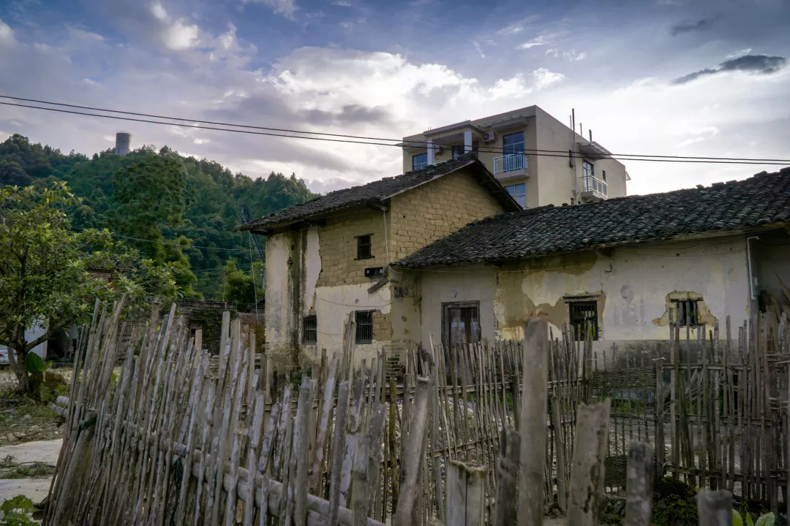
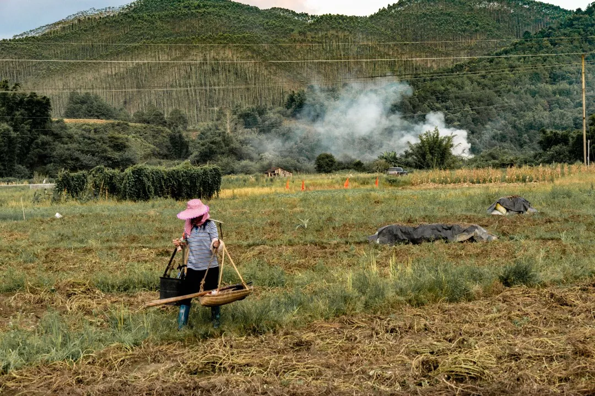
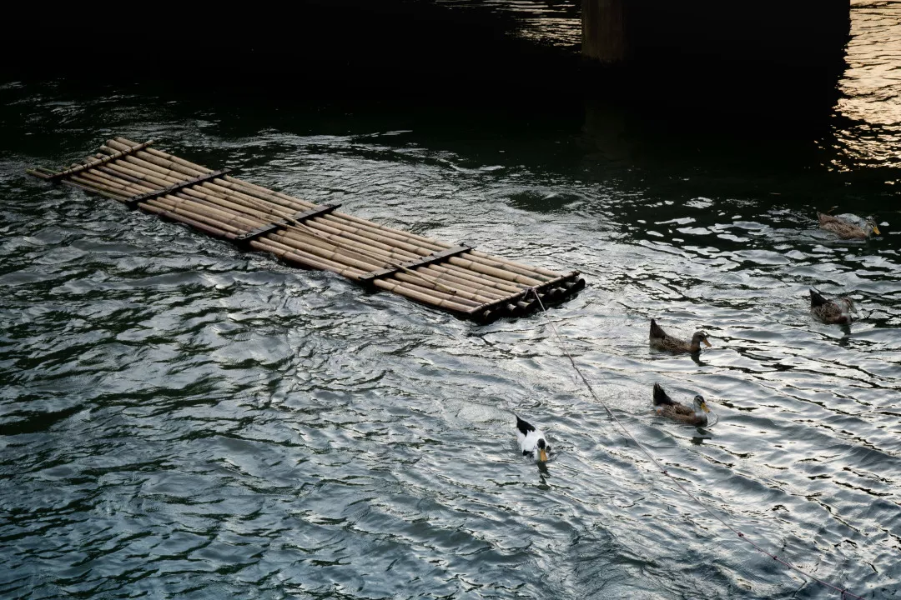
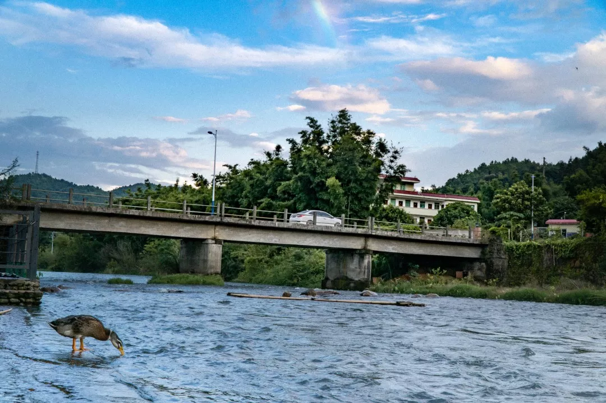
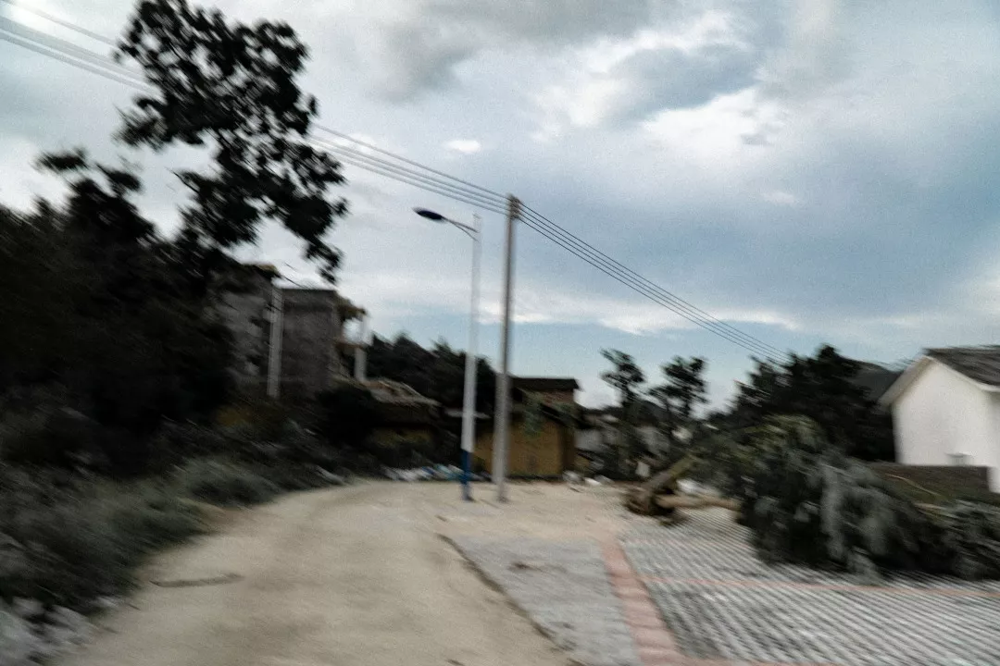
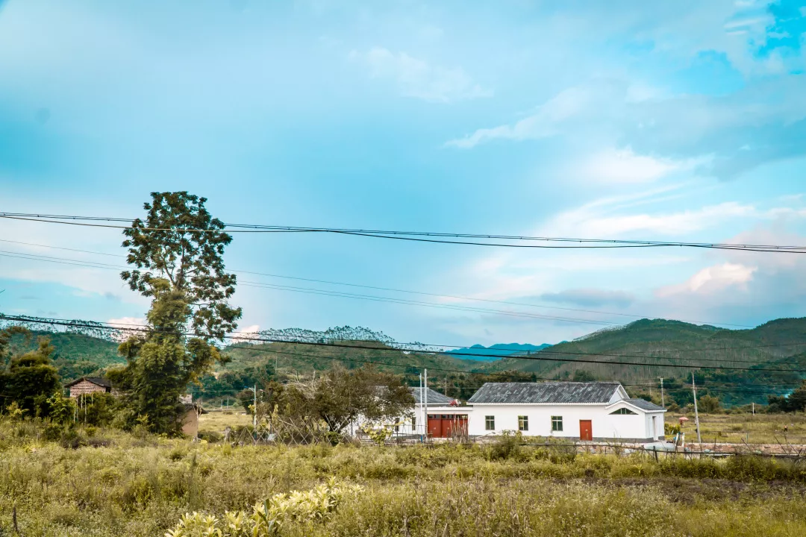
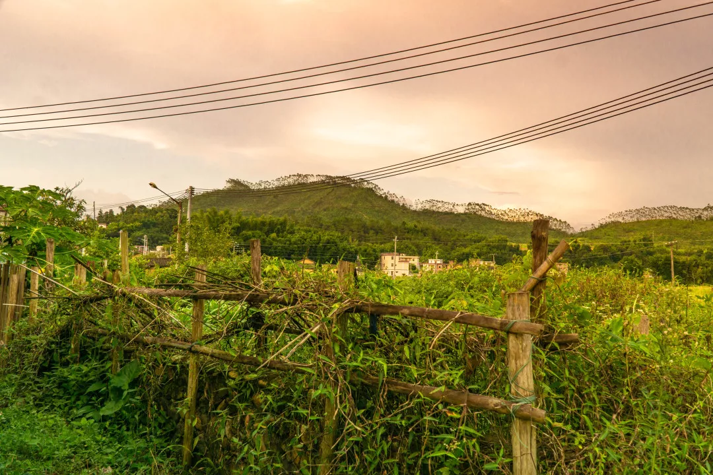

*可能最近又进入了所谓的瓶颈期
*

*脾气比较暴躁*

*想做很多事情 但是都不能让自已满意。*

*不能赖别人 只能抱怨自己*

*然后会想着改变，无论是怎样的改变，都是好的*

*指望着通过改变外界而达到改变自己的目的*

*只要有改变就有希望。*

*所以就有了一次很仓促，距离不是太远的出行*

2019.7.23

*地点在广东省内*

*离东莞很近，可能在广州，可能在增城*

*去哪里其实没有所谓*

*重要的是我好像已经在东莞呆了太久*

*身边太多人在无病呻吟*

*更嘲讽的是 一些连正道都没走上的人 甚至还有资格评判别人*

*想摆脱这一切，但是并没有提升自己的捷径。我想证明自己但是在这个群体里很难得到认可，而凭我自己的能力又够不到我所追求的群体。*

*在中国的countryside拍照，很难。*

*一来缺乏美学上的思考，其次很难挖掘有故事性的内容*

*故事性并不是把社会底层最艰辛的一面拿出来赚眼泪*

*把底层社会脆弱的一面拿出来消费，还借着‘记录人文’的名号，真的很可耻*

*在拍摄农耕中的农民时，一部路虎开了过来，我在想，他们这么勤勤恳恳劳作，这辈子有没有可能开上这样的车呢？
*

*我们在感叹乡村自然的美，但是这种美的背后是他们必须在这种落后的地区煎熬。在自然、原始的环境下，我们或许可以生活一两天，一个礼拜。但是如果要长期生活，并不会选择这种地方。*

*耕地的农民，在我们眼里，跟动物园的动物没什么两样，都是满足我们眼球的事物而已。他们跟这些山山水水没什么两样。*

*回到酒店（民宿？），好像下了点雨。看到有一群鸭子，趁着兴致拿起相机开始拍，然后听到有人说看到了彩虹？看了看，在天上挂着一丁点，还好没有完全消失。
*

*可是这一丁点有什么用呢？我走下去，在河的旁边，用低一点点的角度去拍，正好遇到一直鸭子在喝水，有一部车在桥上经过，我立刻按下快门。*

*跟我同行的朋友，他也带了相机，他拍完彩虹之后跟我讲：“每次拍同样的东西，我们选的角度都不太一样”现在想了想，我好像是有意的。*

*平时拍照，如果有人已经在拍，那么我一定不会再拍。就像之前在ssl的语文老师教我们一样，写作文要先想三个角度，然后放弃这三个角度，从第四个开始写。因为前三个一定被用烂。很多时候我都会刻意避免相同。*

*一直想把片子拍得更加有内涵，但是我发现真的办不到。内涵并非随随便便就能改变.*

*先让自己从底层的观念开始转变*
